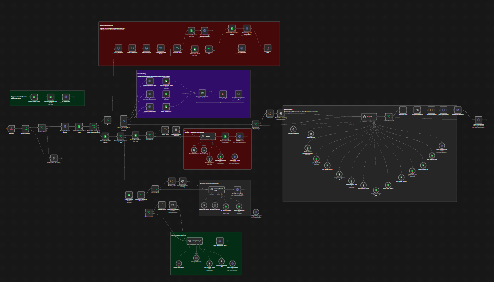

# 🤖 WhatsApp School Automation System — n8n


---

## 📌 Overview

An end-to-end **AI-powered WhatsApp School Automation System** built in n8n that transforms how schools communicate with parents, teachers, and staff. This system handles everything from answering parent queries and processing leave applications to managing student databases and broadcasting announcements — all through WhatsApp!

This project was designed for **Army Burn Hall College** but is fully customizable for any educational institution. It automates the entire communication workflow, saving administrators hours of manual work while providing instant 24/7 support to parents and staff.

---

## 🖼️ Workflow Preview



---

## ⚙️ How It Works

### 🎯 Core Flow

1. **Incoming WhatsApp Message** — Parent, teacher, or unknown number sends a message via WhatsApp
2. **User Identification** — System checks if the number is registered in the database (Parents/Teachers)
3. **Role-Based Routing** — Messages are routed to the appropriate AI agent based on user role:
   - **Parents** → Parent AI Agent (Knowledgebase + Leave Applications)
   - **Teachers** → Teacher Secretary AI (Log messages, Forward to Admin)
   - **Admin** → Admin Control AI (Full database management)
   - **Unknown** → Receptionist AI (Knowledgebase only + Logging)
4. **AI Processing** — The AI analyzes the message, searches the knowledgebase, and generates appropriate responses
5. **Action Execution** — Based on the user's intent, the AI can:
   - Answer questions from the knowledgebase
   - Submit leave applications to Google Sheets
   - Send notifications to admin
   - Update student/parent/teacher records
   - Broadcast messages to specific groups
   - Send voice messages
6. **Response Delivery** — The AI-generated response is sent back via WhatsApp

---

## 🧩 Key Features

### 👨‍👩‍👧‍👦 Parent Communication
- **24/7 AI Assistant** — Parents can ask about school timings, fees, syllabus, exams, and events
- **Leave Applications** — Parents can submit sick leave requests via WhatsApp
- **Voice Message Support** — Parents can send voice notes; AI transcribes and processes them
- **Multi-Language Support** — AI replies in the same language the parent uses
- **Unknown Number Handling** — Unregistered numbers are logged for admin review

### 👨‍🏫 Teacher Management
- **Teacher Inbox** — Teachers can send messages that are logged and summarized for the admin
- **Urgent Alerts** — Teachers can escalate emergencies directly to the admin
- **Staff Directory** — Admin can manage teacher records (add/update/delete)
- **Department Management** — Teachers organized by department and designation

### 👨‍💼 Admin Control
- **Full Database Management** — Add, update, or delete parent/student/teacher records
- **Broadcast System** — Send messages to All Parents, Boarders only, or Day Scholars only
- **Knowledgebase Management** — Add new FAQs and rules to the knowledgebase
- **View Unknown Logs** — See all messages from unregistered numbers
- **Student Leave Management** — View pending leaves, approve/reject them
- **Chat History** — Check conversation history of any parent
- **Voice Message Support** — Send voice messages to any registered user

### 📊 Broadcasting
- **All Parents** — Send announcements to everyone
- **Boarders Only** — Target only boarding students' parents
- **Day Scholars Only** — Target only day scholars' parents
- **Scheduled Sending** — Automatic delays between messages to prevent WhatsApp bans
- **Bulk Processing** — Handles large lists with safety delays

### 📄 Report Card Distribution
- **PDF to WhatsApp** — Upload a PDF report card, and the system automatically:
  - Extracts student names and marks
  - Matches each student to their parent's phone number
  - Sends personalized report cards to each parent
  - Handles data mismatches gracefully
  - Notifies admin of completion

### 📝 Leave Management
- **Auto-Logging** — Parent-submitted leave applications are automatically saved
- **Pending Approval** — All leaves start with "Pending Approval" status
- **Admin Notifications** — Admin receives WhatsApp notification when new leave is submitted
- **Status Updates** — Admin can approve/reject leaves via WhatsApp commands

---

## 🧩 Nodes Used

| Node Type | Purpose |
|-----------|---------|
| **Webhook** | Receives incoming WhatsApp messages |
| **Google Sheets** | Database operations (Parents, Teachers, Knowledgebase, Leaves, Logs) |
| **OpenAI Chat Model** | AI processing for all agents (gpt-4o-mini) |
| **LangChain Agent** | AI agents with tool-calling capabilities |
| **HTTP Request** | Sends messages via Evolution API |
| **Split In Batches** | Processes broadcast lists in batches |
| **Wait** | Adds delays between messages |
| **Switch** | Routes broadcast types (All/Boarder/Day Scholar) |
| **IF** | Conditional routing based on user type |
| **Code** | JavaScript for audio processing and data transformation |
| **Extract From File** | Parses PDF report cards |
| **Google Sheets Trigger** | Monitors for new leave applications |
| **Sticky Note** | Organizes workflow sections |

---

## 💡 Key Design Decisions

- **Role-Based AI Agents** — Separate AI agents for parents, teachers, admin, and unknown users ensure specialized handling
- **Knowledgebase First** — All questions are answered from the knowledgebase before escalating to admin
- **Safety Delays** — Broadcasts include delays between messages to prevent WhatsApp API bans
- **Comprehensive Logging** — Every interaction is logged for audit and review
- **Voice Message Support** — Full audio transcription and voice note generation
- **Multi-Language Mirroring** — AI replies in the user's language (Roman Urdu/English)
- **Centralized Google Sheets Database** — All data stored in Google Sheets for easy access and management
- **Row Number Tracking** — Critical for updating/deleting records without errors
- **Unknown Number Handling** — Logs all unknown interactions for admin review
- **Reaction/Group Shield** — Ignores message reactions and group messages to prevent spam

---

## 🎯 Use Case

Built for **Army Burn Hall College** — but fully adaptable for:
- Schools and colleges
- Universities
- Training centers
- Any educational institution
- Small businesses with multiple customer segments

---

## 🛠️ Tools & Technologies

| Tool | Purpose |
|------|---------|
| **n8n** | Workflow orchestration |
| **OpenAI (gpt-4o-mini)** | AI agents for all user roles |
| **Google Sheets API** | Database for Parents, Teachers, Knowledgebase, Leaves, Logs |
| **Evolution API** | WhatsApp messaging gateway |
| **WhatsApp Cloud API** | Incoming message reception |

---

## 📂 Repository Structure

```
whatsapp-school-automation/
│
├── workflow_overview.png              # Workflow visualization
├── README.md                          # This file
└── LICENSE                            # MIT License
```

---

## 📊 Google Sheets Structure

The system uses **8 Google Sheets** with specific schemas:

### 1. Parents Sheet
| Column | Description |
|--------|-------------|
| ParentName | Full name of parent |
| StudentName | Full name of student |
| Phone | Parent's WhatsApp number |
| Grade | Student's grade/class |
| Status | Boarder / Day Scholar |
| Notes | Additional information |

### 2. Teachers Sheet
| Column | Description |
|--------|-------------|
| Name | Teacher's full name |
| Phone | Teacher's WhatsApp number |
| Designation | Subject Teacher / Class Teacher etc. |
| Department | Math, Science, English, etc. |

### 3. Knowledgebase
| Column | Description |
|--------|-------------|
| Category | Timings, Fees, Exams, Events, General |
| Question | Common question parents might ask |
| Answer | Official response/rule |

### 4. LeaveApplication
| Column | Description |
|--------|-------------|
| Date | Date of application |
| Student | Student name |
| ParentPhone | Parent's phone number |
| Type | Sick, Family, Urgent |
| StartDate | Leave start date |
| EndDate | Leave end date |
| Reason | Reason for leave |
| Status | Pending Approval / Approved / Rejected |
| HomeworkSent | Yes / No |
| FollowUpdate | Additional notes |

### 5. MessageLog
| Column | Description |
|--------|-------------|
| Date | Interaction date |
| Time | Interaction time |
| Phone | User's phone number |
| ParentMessage | User's message |
| Response | AI-generated response |
| Type | AI Knowledgebase / Other |

### 6. UnknownLog
| Column | Description |
|--------|-------------|
| Date | Date of interaction |
| Phone | Unknown number |
| Message | User's message |
| AIresponse | AI's response |
| Status | Student / Parent / Delivery / Spam / Unknown |
| Action | Pending / Reviewed |

### 7. Settings
| Column | Description |
|--------|-------------|
| Setting | Admin Phone Number |
| Value | 923209621960 |

### 8. TeacherInbox
| Column | Description |
|--------|-------------|
| Date | Date of message |
| TeacherName | Sender's name |
| MessageSummary | 1-sentence summary |
| FullMessage | Complete message |
| Urgency | Routine / Urgent |
| Status | Pending / Reviewed |

---

## 🚀 Want to Set This Up?

If you're interested in implementing this WhatsApp School Automation System for your institution, you have two options:

### Option 1: Self-Setup
1. Set up your own n8n instance
2. Configure Google Sheets API with the above structure
3. Set up Evolution API for WhatsApp integration
4. Import the workflow and configure credentials
5. Test thoroughly before going live

### Option 2: Get Professional Setup Support
I can set up the entire system for you — from Google Sheets configuration to n8n deployment and WhatsApp integration. Just drop me an email and I'll handle everything!

📧 **Email:** [alikhansalar5@gmail.com](mailto:alikhansalar5@gmail.com)

---

## 🔐 Security Best Practices

1. **API Keys** — Never hardcode API keys; use n8n credentials
2. **Rate Limiting** — The workflow includes delays to prevent API rate limits
3. **Error Handling** — The workflow includes error handling for missing data
4. **Data Privacy** — All data stays in your Google Sheets
5. **Admin Control** — Only admin phone number can access admin features

---

## 🚀 Advanced Features

### Voice Message Support
- Users can send voice notes; AI transcribes and processes them
- Admin can send voice messages using the `[VOICE_ACTION]` command

### Broadcast Commands
| Command | Action |
|---------|--------|
| `all: [message]` | Send to ALL parents |
| `boarder: [message]` | Send to boarder parents only |
| `dayscholar: [message]` | Send to day scholar parents only |

### Admin Commands
| Command | Action |
|---------|--------|
| `add KB: [info]` | Add to knowledgebase |
| `search KB [query]` | Search knowledgebase |
| `Message [name] [message]` | Send message to parent/teacher |
| `[name] [update]` | Update student/teacher record |
| `view leaves` | View pending leave applications |
| `approve [row]` | Approve leave application |
| `reject [row]` | Reject leave application |

---

## 📈 Performance Metrics

- **Response Time** — Average 2-5 seconds
- **Broadcast Speed** — 1 message every 2 seconds (safety limit)
- **Concurrent Users** — Unlimited (WhatsApp API limits apply)
- **Uptime** — 99.9% (depends on your n8n instance)

---

## 🔧 Customization

### Adding New Knowledgebase Entries
1. Open the Knowledgebase sheet
2. Add a new row with Category, Question, Answer
3. The AI will automatically use the new information

### Adding New Parent/Student
- **Via WhatsApp:** Admin can use: `add student [Name] [Phone] [Grade]`
- **Manual:** Add directly to Parents sheet

### Changing AI Personality
- Update the `text` parameter in the AI Agent nodes
- Modify the system prompts to change tone and behavior

### Adding New Commands
- Extend the AI Agent prompts
- Add new tool nodes
- Connect them to the agent

---

## 🐛 Troubleshooting

### Common Issues

| Issue | Solution |
|-------|----------|
| **Webhook not receiving messages** | Check Evolution API configuration and URL |
| **AI not responding** | Verify OpenAI API key and credits |
| **Google Sheets errors** | Check OAuth2 permissions and sheet access |
| **Broadcast not sending** | Verify all parents have phone numbers |
| **Voice messages not working** | Check `base64` is enabled in Evolution API |
| **Unknown number not logged** | Check UnknownLog sheet exists with correct columns |


---

## 📝 License

This project is open source and available under the [MIT License](LICENSE).

---

## 🙏 Acknowledgments

- **Army Burn Hall College** — For the real-world use case
- **n8n** — For the amazing workflow automation platform
- **OpenAI** — For GPT-4o-mini powering the AI agents
- **Evolution API** — For WhatsApp integration
- **Google Sheets** — For serving as the database

---


## 🔄 Version History

| Version | Date | Changes |
|---------|------|---------|
| 1.0.0 | 2026-06-25 | Initial release |
| 1.1.0 | 2026-06-25 | Added voice message support |
| 1.2.0 | 2026-06-25 | Added report card distribution |
| 1.3.0 | 2026-06-25 | Added teacher inbox system |

---


## 👨‍💻 Author

**Bhadur Ali** — Data Analyst & AI Automation Builder

MS Data Science · PAF-IAST

[](https://linkedin.com/in/bhadur-ali)
[](mailto:alikhansalar5@gmail.com)
[](https://github.com/BhadurAli)
